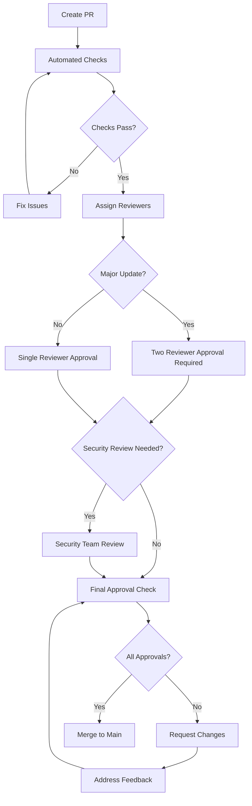

# Dependency Update Code Review Process

## Overview

This document outlines the mandatory code review process for dependency updates, ensuring proper validation, testing, and approval before changes are merged to the main branch.

## Review Requirements by Update Type

### Major Version Updates (x.0.0)

#### Approval Requirements
- **Two Reviewer Approvals**: Minimum two different team members must approve
- **Lead Developer Approval**: Technical lead or senior developer must be one reviewer
- **Security Review**: Required for security-related dependencies
- **Architecture Review**: Required for framework or core infrastructure updates

#### Required Documentation
- [ ] **Breaking Changes Analysis**: Complete analysis of all breaking changes
- [ ] **Migration Guide**: Step-by-step migration instructions
- [ ] **Performance Impact Report**: Before/after performance metrics
- [ ] **Security Audit Results**: npm audit and vulnerability scan results
- [ ] **Rollback Plan**: Detailed rollback procedure
- [ ] **Test Results**: Full test suite results attached

#### Review Checklist for Major Updates
```markdown
## Major Version Update Review Checklist

### Code Quality Review
- [ ] All breaking changes properly addressed
- [ ] Code follows project coding standards
- [ ] No console.log or debug statements left in code
- [ ] Error handling updated for new API changes
- [ ] TypeScript types properly updated

### Testing Review
- [ ] All existing tests pass
- [ ] New tests added for changed functionality
- [ ] Edge cases properly tested
- [ ] Performance tests included
- [ ] Manual testing completed for critical paths

### Documentation Review
- [ ] README updated with new requirements
- [ ] API documentation reflects changes
- [ ] Migration guide is clear and complete
- [ ] CHANGELOG updated with breaking changes

### Security Review
- [ ] npm audit shows no new vulnerabilities
- [ ] Dependency licenses reviewed
- [ ] No insecure coding patterns introduced
- [ ] Authentication/authorization not compromised

### Performance Review
- [ ] Bundle size impact documented
- [ ] Runtime performance impact assessed
- [ ] Memory usage impact analyzed
- [ ] Database query performance verified
```

### Minor Version Updates (x.y.0)

#### Approval Requirements
- **One Reviewer Approval**: Single reviewer with domain expertise
- **Automated Tests**: All automated tests must pass
- **Performance Check**: Basic performance impact assessment

#### Required Documentation
- [ ] **Feature Overview**: Summary of new features/improvements
- [ ] **Test Results**: Automated test results
- [ ] **Performance Check**: Basic performance metrics
- [ ] **Compatibility Verification**: Backward compatibility confirmed

#### Review Checklist for Minor Updates
```markdown
## Minor Version Update Review Checklist

### Functionality Review
- [ ] New features properly integrated
- [ ] Existing functionality not broken
- [ ] Configuration changes properly applied
- [ ] Dependencies properly resolved

### Testing Review
- [ ] Automated tests pass
- [ ] Regression tests executed
- [ ] Basic manual testing completed
- [ ] Critical user paths verified

### Compatibility Review
- [ ] Backward compatibility maintained
- [ ] No breaking changes introduced
- [ ] API contracts preserved
- [ ] Database compatibility verified
```

### Patch Version Updates (x.y.z)

#### Approval Requirements
- **One Reviewer Approval**: Any team member can review
- **Automated Tests**: Basic test suite must pass
- **Security Check**: Security audit for security patches

#### Required Documentation
- [ ] **Bug Fixes Summary**: List of bugs fixed
- [ ] **Security Patches**: Security vulnerabilities addressed
- [ ] **Test Results**: Basic test results

#### Review Checklist for Patch Updates
```markdown
## Patch Version Update Review Checklist

### Bug Fix Review
- [ ] Bug fixes properly implemented
- [ ] No new issues introduced
- [ ] Edge cases considered
- [ ] Regression tests added

### Security Review (if applicable)
- [ ] Security vulnerabilities patched
- [ ] No new security issues introduced
- [ ] Security audit clean
```

## Pull Request Template for Dependency Updates

```markdown
# Dependency Update: [Package Name] v[old] → v[new]

## Update Type
- [ ] Major Version (x.0.0)
- [ ] Minor Version (x.y.0)
- [ ] Patch Version (x.y.z)
- [ ] Security Patch

## Breaking Changes
<!-- List all breaking changes or mark as N/A -->
- [ ] N/A - No breaking changes
- [ ] Breaking Change 1: [Description]
- [ ] Breaking Change 2: [Description]

## Changes Made
<!-- Describe what was changed in the codebase -->
- [ ] Updated package.json versions
- [ ] Applied breaking change fixes
- [ ] Updated tests
- [ ] Updated documentation
- [ ] Updated configuration files

## Testing Performed
<!-- Check all that apply -->
- [ ] Unit tests pass
- [ ] Integration tests pass
- [ ] E2E tests pass
- [ ] Manual testing completed
- [ ] Performance testing completed
- [ ] Security audit completed

## Test Results
<!-- Attach test results -->
```
npm test
✓ All tests passed (XXX tests, XXX ms)

npm audit
found 0 vulnerabilities
```

## Performance Impact
<!-- For major/minor updates -->
- Bundle size change: +/-XX KB
- Runtime performance: No significant impact
- Memory usage: No significant impact

## Security Assessment
<!-- Include audit results -->
- npm audit: No vulnerabilities found
- License compatibility: Verified
- Supply chain security: Verified

## Migration Guide
<!-- For breaking changes -->
### Before
```javascript
// Old code example
```

### After
```javascript
// New code example
```

## Rollback Plan
<!-- Required for major updates -->
1. Revert commit: `git revert [commit-hash]`
2. Redeploy previous version
3. Clear caches if needed

## Reviewer Checklist
- [ ] Code review completed
- [ ] Tests verified
- [ ] Documentation reviewed
- [ ] Security assessment reviewed
- [ ] Performance impact acceptable
- [ ] Rollback plan adequate

## Additional Notes
<!-- Any additional context or concerns -->
```

## Automated Review Gates

### GitHub Actions Integration

Create automated checks that must pass before human review:

```yaml
# .github/workflows/dependency-review.yml
name: Dependency Review

on:
  pull_request:
    paths:
      - '**/package.json'
      - '**/package-lock.json'

jobs:
  dependency-review:
    runs-on: ubuntu-latest
    steps:
      - name: Checkout
        uses: actions/checkout@v3
        
      - name: Dependency Review
        uses: actions/dependency-review-action@v3
        with:
          fail-on-severity: moderate
          
      - name: Security Audit
        run: |
          npm ci
          npm audit --audit-level=moderate
          
      - name: License Check
        run: |
          npx license-checker --onlyAllow "MIT;Apache-2.0;BSD-2-Clause;BSD-3-Clause"
          
      - name: Test Suite
        run: |
          npm run test
          npm run test:integration
          
      - name: Build Check
        run: |
          npm run build
```

### Required Status Checks

Configure branch protection rules requiring these checks:
- ✅ Dependency Review
- ✅ Security Audit
- ✅ Test Suite
- ✅ Build Check
- ✅ License Check

## Review Assignment Rules

### Automatic Reviewer Assignment

Configure CODEOWNERS for automatic review assignment:

```bash
# .github/CODEOWNERS

# Dependency updates require specific reviewers
package.json @lead-developer @security-team
package-lock.json @lead-developer
*/package.json @team-leads
*/package-lock.json @team-leads

# Critical dependencies require additional review
package.json @architecture-team (if framework updates)
```

### Reviewer Expertise Matrix

| Dependency Type | Required Reviewer | Backup Reviewer |
|----------------|------------------|-----------------|
| Frontend Framework | Frontend Lead | Senior Frontend Dev |
| Backend Framework | Backend Lead | Senior Backend Dev |
| Security Libraries | Security Team | Lead Developer |
| Database Drivers | DBA/Backend Lead | Senior Backend Dev |
| Build Tools | DevOps Lead | Senior Developer |
| Testing Tools | QA Lead | Senior Developer |

## Review Process Flow



## Emergency Review Process

For critical security vulnerabilities:

### Fast-Track Approval
- **Single Reviewer**: Senior developer or lead
- **Security Team Notification**: Must be notified within 2 hours
- **Expedited Testing**: Critical path tests only
- **Post-Merge Review**: Full review within 24 hours

### Emergency Review Template
```markdown
# EMERGENCY SECURITY UPDATE

## Vulnerability Details
- CVE: [CVE number if available]
- Severity: [Critical/High]
- CVSS Score: [Score]
- Affected Package: [Package name and version]

## Impact Assessment
- [ ] Application is vulnerable
- [ ] Exploitation possible
- [ ] Data at risk
- [ ] Immediate action required

## Emergency Actions Taken
- [ ] Security patch applied
- [ ] Critical tests pass
- [ ] Staging deployment successful
- [ ] Security team notified

## Post-Emergency Requirements
- [ ] Full test suite execution
- [ ] Complete security audit
- [ ] Documentation update
- [ ] Incident post-mortem
```

## Review Quality Metrics

Track these metrics to ensure review effectiveness:

### Review Coverage Metrics
- Percentage of dependency updates reviewed
- Average review time by update type
- Review approval/rejection rates
- Security issue detection rate

### Quality Metrics
- Post-merge issues related to dependency updates
- Rollback frequency for dependency updates
- Security vulnerabilities introduced
- Performance regressions introduced

### Review Dashboard
```markdown
## Monthly Dependency Review Metrics

| Metric | Current Month | Previous Month | Trend |
|--------|---------------|----------------|-------|
| Major Updates Reviewed | 5 | 3 | ↑ |
| Security Issues Found | 2 | 1 | ↑ |
| Average Review Time | 2.3 days | 2.8 days | ↓ |
| Rollbacks Required | 0 | 1 | ↓ |
| Tests Failed in Review | 8% | 12% | ↓ |
```

## Reviewer Training Guidelines

### New Reviewer Onboarding
1. **Review Process Training**: Understand the review workflow
2. **Security Awareness**: Learn to identify security issues
3. **Performance Impact**: Understand performance implications
4. **Tool Familiarity**: Learn npm audit, testing tools
5. **Shadow Reviews**: Participate in reviews with experienced reviewers

### Ongoing Training
- Monthly security update sessions
- Quarterly review process improvements
- Annual reviewer certification

## Review Tool Integration

### GitHub Integration
- Pull request templates for dependency updates
- Automated reviewer assignment
- Required status checks
- Branch protection rules

### Slack Integration
- Automated notifications for review requests
- Security alert notifications
- Review completion notifications

### Monitoring Integration
- Review metrics dashboard
- Performance impact tracking
- Security vulnerability monitoring
